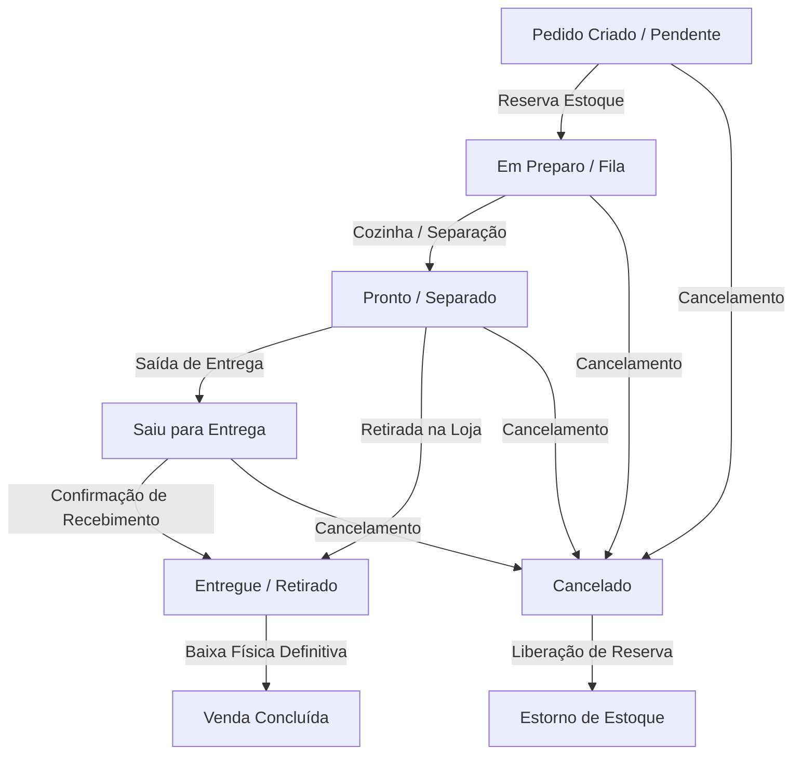

# Fluxo Operacional: ERP Salgaderia

Este documento estabelece o ciclo de vida dos pedidos, a movimentação de estoque e a arquitetura operacional do sistema. Toda e qualquer alteração de código ou funcionalidade deve obedecer às regras descritas neste fluxo.

---

## 1. MÁQUINA DE ESTADOS DO PEDIDO

Um pedido passa pelas seguintes etapas operacionais em seu ciclo de vida:

### Relação de Status:
1. **Pendente (Ativo):** Pedido recebido e inserido no sistema. Reserva estoque disponível.
2. **Em Preparo (Ativo):** Pedido na cozinha ou em fase de separação. Mantém a reserva de estoque.
3. **Pronto (Ativo):** Pedido totalmente separado e embalado, aguardando saída ou retirada. Mantém a reserva.
4. **Saiu para Entrega (Ativo):** Pedido em rota de entrega pelo motoboy. Mantém a reserva.
5. **Entregue (Finalizado):** Pedido entregue ao cliente. Libera a reserva e deduz o estoque físico correspondente.
6. **Retirado (Finalizado):** Pedido retirado pelo cliente na loja. Libera a reserva e deduz o estoque físico correspondente.
7. **Cancelado (Cancelado):** Pedido cancelado. Desfaz a reserva de estoque imediatamente, voltando a quantidade para o estoque disponível.

---

## 2. CONCEITO DE ESTOQUES

O ERP gerencia o estoque de produtos acabados de forma tripartida:

$$\text{Estoque Disponível} = \text{Estoque Físico} - \text{Estoque Reservado}$$

### Definições:
- **Estoque Físico (Saldo Real):** Quantidade física presente no estabelecimento.
- **Estoque Reservado (Comprometido):** Quantidade já vendida em pedidos com status Ativo (Pendente, Em Preparo, Pronto, Saiu para Entrega) que ainda não foram entregues ou retirados.
- **Estoque Disponível (Livre):** Quantidade disponível para novas vendas. Evita que o comercial venda um salgado que já está prometido para outra entrega.

---

## 3. REGRA GERAL DE RASTREABILIDADE

> [!IMPORTANT]
> **Nenhum módulo ou tela pode alterar diretamente o estoque físico.**
> Todas as alterações de saldo de estoque devem ocorrer por meio de **eventos operacionais**, gerando um registro correspondente na tabela de `movimentacoes_estoque`. Isso assegura auditoria, controle financeiro e rastreabilidade total de perdas, produção e vendas.

### Tipos de Movimentações Mapeadas:
* **ENTRADA_PRODUCAO:** Lançado exclusivamente pela tela de **Produção** (fabricação diária).
* **RESERVA:** Lançado automaticamente na criação de um pedido ou ao reativar um pedido cancelado.
* **LIBERACAO_RESERVA:** Lançado automaticamente ao cancelar um pedido ativo.
* **BAIXA_ENTREGA / BAIXA_RETIRADA:** Lançado no momento em que o pedido é alterado para status finalizado (`Entregue` ou `Retirado`).
* **AJUSTE_POSITIVO / AJUSTE_NEGATIVO:** Lançado manualmente por operadores autorizados na tela de **Movimentações** (com motivos detalhados de quebras, perdas, doações ou acertos de inventário).
